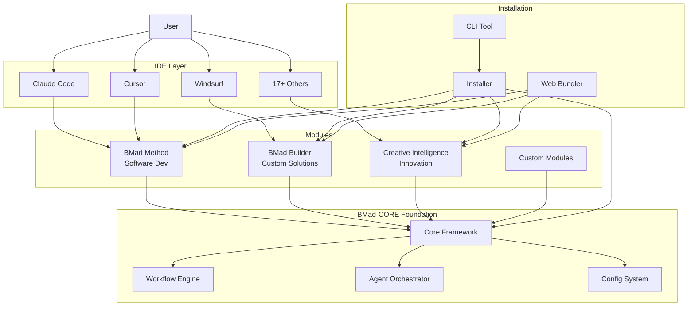
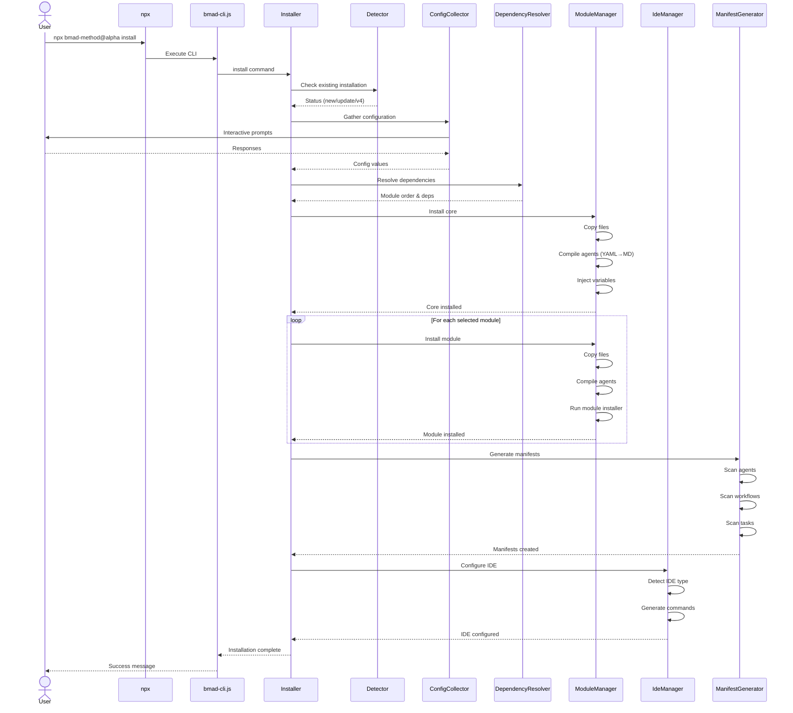
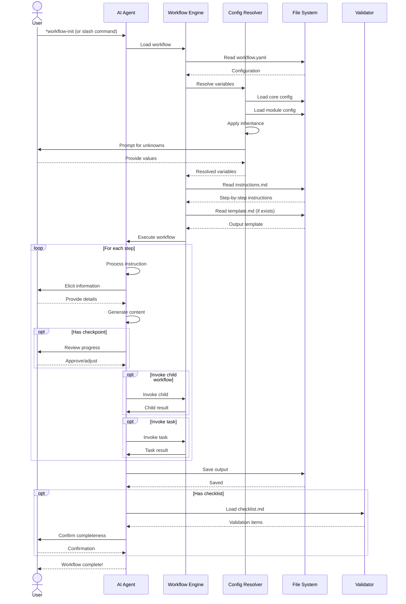
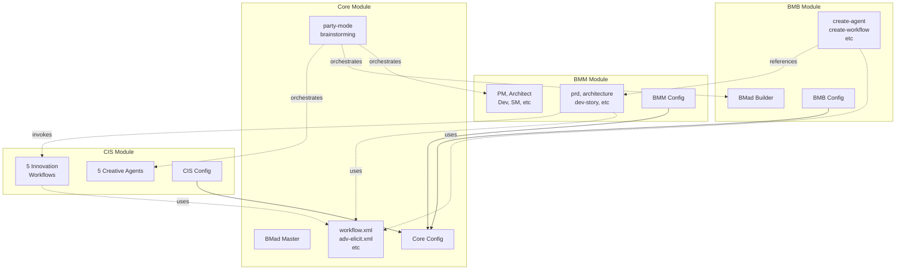
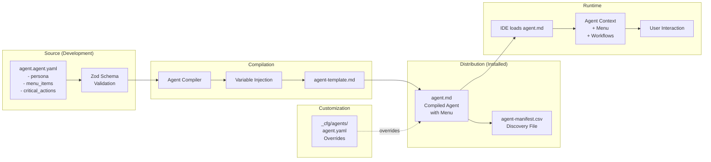
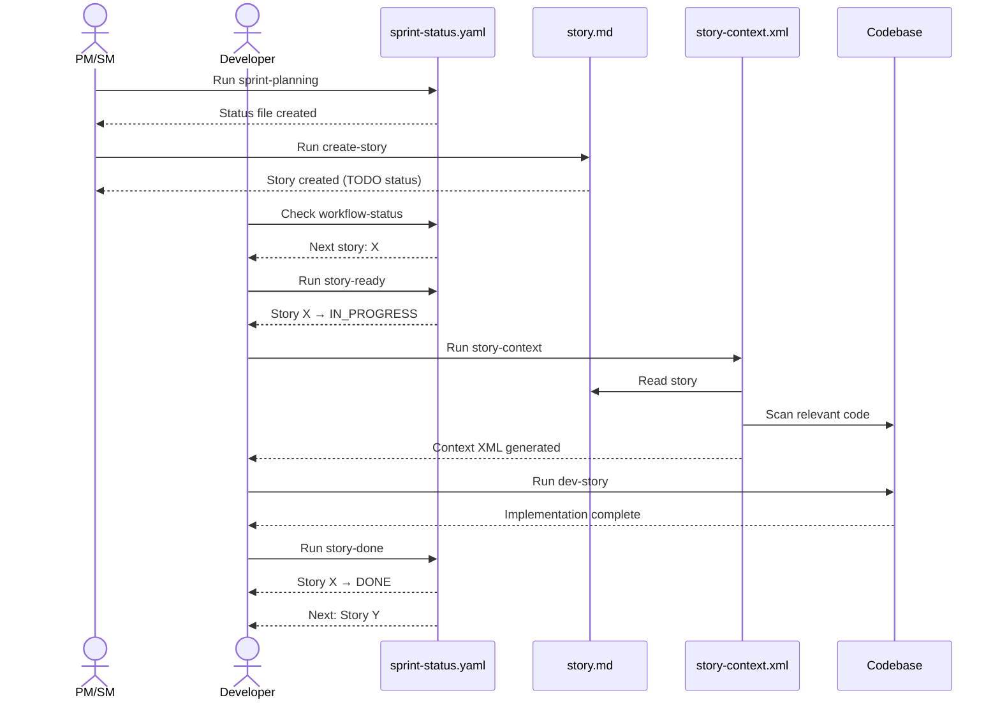
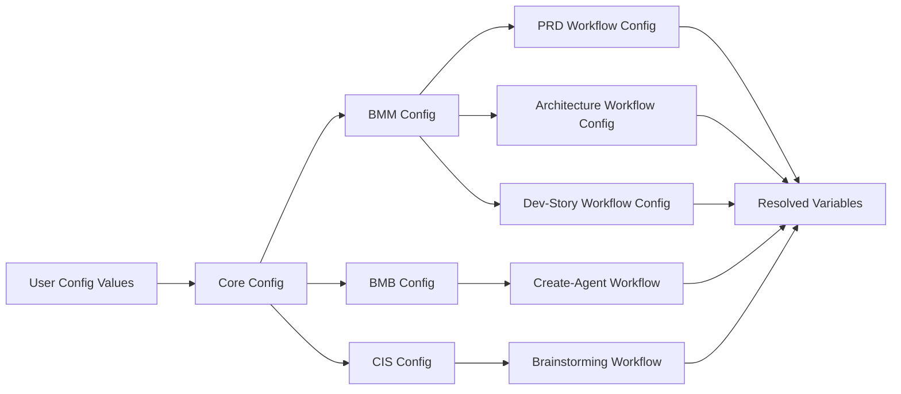
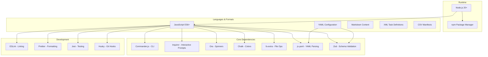

# BMad Method Architecture Guide

Visual diagrams and explanations of BMad Method's architecture, flows, and systems.

---

## Table of Contents

- [System Overview](#system-overview)
- [Installation Flow](#installation-flow)
- [Workflow Execution Flow](#workflow-execution-flow)
- [Configuration Resolution](#configuration-resolution)
- [Module System](#module-system)
- [Agent Orchestration](#agent-orchestration)
- [File Structure](#file-structure)

---

## System Overview

High-level architecture of BMad Method:



**Key Components:**

- **BMad-CORE**: Foundation providing agent orchestration, workflow engine, and config management
- **Modules**: Domain-specific solutions built on CORE (BMM for dev, BMB for building, CIS for creativity)
- **IDE Layer**: Integration adapters for 17+ IDEs
- **Installation**: CLI tools for setup, updates, and web bundling

---

## Installation Flow

Complete installation process from npx to ready-to-use agents:



**Key Steps:**

1. **Detection**: Check for existing installation (new, update, or v4 upgrade)
2. **Configuration**: Interactive prompts for user preferences
3. **Dependency Resolution**: Determine module install order
4. **Module Installation**: Copy files, compile agents, inject variables
5. **Manifest Generation**: Create CSV discovery files
6. **IDE Integration**: Configure IDE-specific commands

---

## Workflow Execution Flow

How a workflow executes from invocation to completion:



**Execution Phases:**

1. **Load**: Read workflow configuration and instructions
2. **Resolve**: Process variables through config chain
3. **Execute**: Step through instructions with agent guidance
4. **Generate**: Create output based on template and user input
5. **Validate**: Check against optional checklist
6. **Save**: Write output to configured location

---

## Configuration Resolution

How variables resolve through the inheritance chain:

```mermaid
graph TD
    A[Variable Reference: {project_name}] --> B{In workflow.yaml?}
    B -->|Yes| C[Use workflow value]
    B -->|No| D{Reference to external config?}

    D -->|Yes: {config_source}:key| E[Load external config]
    E --> F{Key exists?}
    F -->|Yes| G[Use external value]
    F -->|No| H[Continue chain]

    D -->|No| I{In module config?}
    I -->|Yes| J[Use module value]
    I -->|No| K{In core config?}

    K -->|Yes| L[Use core value]
    K -->|No| M{System variable?}

    M -->|Yes: project-root, date, etc| N[Compute system value]
    M -->|No| O{Required?}

    O -->|Yes| P[Prompt user at runtime]
    P --> Q[Use provided value]
    O -->|No| R[Use empty/default]

    C --> S[Resolved!]
    G --> S
    J --> S
    L --> S
    N --> S
    Q --> S
    R --> S
```

**Resolution Order:**

1. **Workflow config**: Direct value in `workflow.yaml`
2. **External config**: Referenced via `{config_source}:key`
3. **Module config**: Inherited from module's `config.yaml`
4. **Core config**: Base values from core's `config.yaml`
5. **System variables**: Computed values like `{project-root}`, `{date}`
6. **Runtime prompt**: Ask user if still unknown and required

**Example:**

```yaml
# workflow.yaml
config_source: '{project-root}/{bmad_folder}/bmm/config.yaml'
project_name: '{config_source}:project_name'
output_file: '{project-root}/{output_folder}/{project_name}-prd.md'
```

Resolves to:

```
/home/user/my-project/docs/MyProject-prd.md
```

---

## Module System

How modules interact with core and each other:



**Key Relationships:**

- **Config Inheritance**: All module configs inherit from core config
- **Task Sharing**: All modules can use core tasks (workflow engine, elicitation, etc.)
- **Cross-Module Workflows**: Modules can invoke workflows from other modules
- **Agent Discovery**: Party mode discovers all installed agents via manifests

---

## Agent Orchestration

How agents are structured and loaded:



**Agent Lifecycle:**

1. **Define**: Create `.agent.yaml` with persona, menu, critical actions
2. **Validate**: Schema validation ensures correctness
3. **Compile**: Transform to `.md` with variable injection
4. **Manifest**: Register in `agent-manifest.csv` for discovery
5. **Customize**: Optional user overrides in `_cfg/agents/`
6. **Load**: IDE loads compiled `.md` file
7. **Execute**: User interacts with agent and workflows

---

## File Structure

Complete project structure after installation:

```
project-root/
├── .bmad/                          # BMad installation (or custom name)
│   ├── core/                       # Core module
│   │   ├── agents/
│   │   │   └── bmad-master.md
│   │   ├── tasks/
│   │   │   ├── workflow.xml
│   │   │   ├── adv-elicit.xml
│   │   │   └── ...
│   │   ├── workflows/
│   │   │   ├── party-mode/
│   │   │   └── brainstorming/
│   │   ├── tools/
│   │   │   └── shard-doc/
│   │   └── config.yaml             # Core configuration
│   │
│   ├── bmm/                        # BMad Method module
│   │   ├── agents/
│   │   │   ├── pm.md
│   │   │   ├── architect.md
│   │   │   ├── dev.md
│   │   │   └── ... (12 agents)
│   │   ├── workflows/
│   │   │   ├── prd/
│   │   │   │   ├── workflow.yaml
│   │   │   │   ├── instructions.md
│   │   │   │   ├── template.md
│   │   │   │   └── checklist.md
│   │   │   └── ... (34 workflows)
│   │   ├── testarch/               # Test workflows
│   │   ├── docs/                   # Module documentation
│   │   └── config.yaml             # BMM configuration
│   │
│   ├── bmb/                        # BMad Builder module
│   │   ├── agents/
│   │   │   └── bmad-builder.md
│   │   ├── workflows/
│   │   │   ├── create-agent/
│   │   │   ├── create-workflow/
│   │   │   └── ... (7 workflows)
│   │   └── config.yaml
│   │
│   ├── cis/                        # Creative Intelligence Suite
│   │   ├── agents/
│   │   │   └── ... (5 agents)
│   │   ├── workflows/
│   │   │   └── ... (5 workflows)
│   │   └── config.yaml
│   │
│   └── _cfg/                       # Global configuration (update-safe)
│       ├── manifest.yaml           # Installation manifest
│       ├── agent-manifest.csv      # Agent discovery
│       ├── workflow-manifest.csv   # Workflow discovery
│       ├── task-manifest.csv       # Task discovery
│       └── agents/                 # Agent customizations
│           └── pm.yaml             # Example customization
│
├── .bmad-ephemeral/                # Phase 4 artifacts (gitignored)
│   ├── sprint-status.yaml
│   ├── stories/
│   └── epics/
│
├── docs/                           # Durable documentation (committed)
│   ├── PRD.md
│   ├── Architecture.md
│   ├── technical/
│   └── ...
│
├── .claude/                        # IDE integration (Claude Code)
│   └── commands/
│       └── bmad/
│           └── ... (command files)
│
└── src/                            # Your application code
```

**Key Directories:**

- **`.bmad/`**: All BMad Method installation files
  - **`core/`**: Foundation framework
  - **`bmm/`**, **`bmb/`**, **`cis/`**: Optional modules
  - **`_cfg/`**: User customizations (survives updates)
- **`.bmad-ephemeral/`**: Temporary Phase 4 artifacts
- **`docs/`**: Permanent project documentation
- **`.claude/`** (or IDE-specific): IDE integration

---

## Data Flow Diagrams

### Phase 4 Story Development Flow



### Configuration Inheritance Flow



---

## Component Interaction Matrix

| Component              | Depends On            | Used By                | Purpose                  |
| ---------------------- | --------------------- | ---------------------- | ------------------------ |
| **BMad-CORE**          | None                  | All modules            | Foundation framework     |
| **Workflow Engine**    | Core                  | All workflows          | XML-based execution      |
| **Config System**      | Core                  | All modules, workflows | Variable resolution      |
| **Agent Orchestrator** | Core                  | Party mode             | Multi-agent coordination |
| **BMM Module**         | Core                  | Developers             | Software development     |
| **BMB Module**         | Core, BMM (reference) | Module creators        | Custom solutions         |
| **CIS Module**         | Core                  | BMM (invoked), Users   | Innovation workflows     |
| **Installer**          | Node.js, npm          | Users                  | Setup and updates        |
| **CLI**                | Installer             | Users                  | Command interface        |
| **Web Bundler**        | Modules               | Web IDEs               | Self-contained agents    |
| **Manifest Generator** | Modules               | Runtime discovery      | CSV manifests            |
| **IDE Adapters**       | Installer             | IDEs                   | Integration layer        |

---

## Technology Stack



---

## Design Patterns

### 1. **Module Pattern**

- Self-contained modules with own agents, workflows, and config
- Dependency injection via core framework
- Hot-swappable (install/uninstall independently)

### 2. **Strategy Pattern**

- IDE adapters implement common interface
- Different strategies for Claude Code, Cursor, Windsurf, etc.
- Configurable at installation time

### 3. **Template Method Pattern**

- Workflow engine defines execution skeleton
- Individual workflows customize steps
- Hooks for validation, elicitation, child workflows

### 4. **Observer Pattern**

- Sprint status tracks story state changes
- Workflows update status as stories progress
- Multiple workflows can observe/modify status

### 5. **Builder Pattern**

- Agent compilation builds from YAML source
- Variable injection, template application
- Progressive enhancement with customizations

### 6. **Facade Pattern**

- BMad Master agent provides unified interface
- Hides complexity of module system
- Single entry point for users

---

## Security Considerations

1. **No Network Access**: Workflows don't make external calls (except user-initiated web search)
2. **File System Sandboxing**: Agents only access configured paths
3. **Configuration Validation**: Zod schema validation prevents injection
4. **Update Safety**: Customizations in `_cfg/` never overwritten
5. **No Executable Code Generation**: Agents guide humans, don't run code directly

---

## Performance Optimizations

1. **Lazy Loading**: Workflows loaded on-demand, not at startup
2. **Manifest Caching**: CSV manifests avoid file system scans
3. **Document Sharding**: Load only needed sections (90% token savings)
4. **Compilation**: YAML→MD compilation done at install, not runtime
5. **Parallel Module Installation**: Independent modules install concurrently

---

## Future Architecture (Roadmap)

**Planned Enhancements:**

1. **Plugin System**: Third-party modules via registry
2. **Knowledge Base**: Vector database for agent intelligence
3. **MCP Integration**: Model Context Protocol for tool use
4. **Sub-Agents**: Specialized sub-agents for complex tasks
5. **WebAssembly**: Browser-based workflow execution

---

## Further Reading

- **[Installation Guide](../README.md#installation)** - Setup instructions
- **[Developer Guide](../CONTRIBUTING.md)** - Contributing to core
- **[Module Development](../src/modules/bmb/README.md)** - Creating modules
- **[Workflow Guide](../src/modules/bmm/workflows/README.md)** - Understanding workflows

---

_Architecture documentation for BMad Method v6.0.0-alpha.8_
