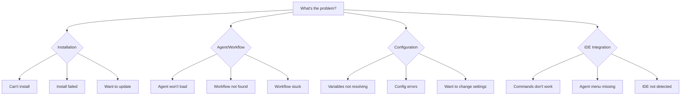

# BMad Method Troubleshooting Guide

Systematic guide to diagnosing and resolving common issues with BMad Method.

---

## Quick Diagnostic

**Start here to quickly identify your issue:**



---

## Installation Issues

### Installation Failed or Won't Start

**Symptoms:**
- `npx bmad-method@alpha install` fails
- Error messages during installation
- Installation hangs or times out

**Diagnostic Steps:**

1. **Check Node.js version**
   ```bash
   node --version
   # Must be v20.0.0 or higher
   ```
   - If lower, install Node.js 20+ from [nodejs.org](https://nodejs.org)

2. **Check npm connectivity**
   ```bash
   npm ping
   # Should return "Ping success"
   ```
   - If fails, check network/proxy settings

3. **Check file permissions**
   ```bash
   ls -la
   # Ensure you have write access to current directory
   ```
   - If denied, run in a directory you own or use `sudo` (not recommended)

4. **Try with verbose logging**
   ```bash
   npx bmad-method@alpha install --verbose
   # Shows detailed installation progress
   ```

5. **Clear npm cache**
   ```bash
   npm cache clean --force
   npx bmad-method@alpha install
   ```

**Solutions:**

| Error Message | Solution |
|---------------|----------|
| "Node version too old" | Upgrade Node.js to v20+ |
| "Permission denied" | Check folder permissions or run in home directory |
| "Module not found" | Clear npm cache: `npm cache clean --force` |
| "Cannot find module 'bmad-method'" | Ensure npm is properly installed: `npm --version` |
| "Installation timeout" | Check network connection, try again |

### Installation Incomplete or Corrupted

**Symptoms:**
- Installation completed but agents missing
- Config files not created
- Manifests empty or missing

**Diagnostic Command:**
```bash
npx bmad-method@alpha doctor
```

This runs comprehensive health checks and reports specific issues.

**Solutions:**

1. **Reinstall with force flag**
   ```bash
   npx bmad-method@alpha install --force
   ```

2. **Check installation status**
   ```bash
   npx bmad-method@alpha status
   ```

3. **Manually verify key files exist:**
   ```bash
   ls -la .bmad/_cfg/manifest.yaml
   ls -la .bmad/core/config.yaml
   ls -la .bmad/bmm/agents/
   ```

4. **If specific module missing:**
   ```bash
   npx bmad-method@alpha install --modules=bmm,bmb,cis
   ```

### Update Issues

**Symptoms:**
- Update fails mid-process
- "No installation found" after update
- Customizations lost after update

**Solutions:**

1. **Verify installation exists**
   ```bash
   npx bmad-method@alpha status
   ```

2. **Backup customizations before update**
   ```bash
   cp -r .bmad/_cfg .bmad/_cfg.backup
   ```

3. **Run update with verbose output**
   ```bash
   npx bmad-method@alpha update --verbose
   ```

4. **If update fails, reinstall over existing**
   ```bash
   npx bmad-method@alpha install
   # Choose "update" when prompted
   ```

5. **Restore customizations if lost**
   ```bash
   cp -r .bmad/_cfg.backup/* .bmad/_cfg/
   ```

---

## Agent & Workflow Issues

### Agent Won't Load in IDE

**Decision Tree:**

```
Agent won't load
├─ File doesn't exist?
│  ├─ Installation incomplete → Run: bmad doctor
│  └─ Wrong path → Check: .bmad/[module]/agents/
├─ File exists but blank/corrupted?
│  └─ Reinstall module → bmad install --force
├─ IDE doesn't recognize file?
│  ├─ Wrong IDE config → Check: docs/ide-info/[your-ide].md
│  └─ Need to restart IDE → Close and reopen IDE
└─ Agent loads but no menu?
   └─ Try fresh chat → Start new conversation
```

**Step-by-Step Solutions:**

1. **Verify agent file exists**
   ```bash
   ls -la .bmad/bmm/agents/pm.md
   # Should show file with content
   ```

2. **Check file is readable**
   ```bash
   head -20 .bmad/bmm/agents/pm.md
   # Should show agent content, not binary or empty
   ```

3. **Verify IDE integration**
   - Check your IDE's docs: [docs/ide-info/](./ide-info/)
   - Ensure slash commands are installed
   - Try loading agent using absolute path

4. **Test with different agent**
   ```bash
   # Try loading BMad Master (core agent)
   # Load: .bmad/core/agents/bmad-master.md
   ```

5. **Reinstall if file corrupted**
   ```bash
   npx bmad-method@alpha install --force
   ```

### Workflow Not Found

**Symptoms:**
- Agent says "workflow not found"
- Slash command returns error
- Workflow shows as "todo" in menu

**Solutions:**

1. **Check workflow exists in module**
   ```bash
   ls -la .bmad/bmm/workflows/prd/
   # Should contain: workflow.yaml, instructions.md, template.md
   ```

2. **Verify workflow-manifest.csv**
   ```bash
   grep "prd" .bmad/_cfg/workflow-manifest.csv
   # Should show workflow entry
   ```

3. **If workflow marked as "todo"**
   - Workflow not implemented yet
   - Check module README for available workflows
   - Use `bmad list` to see all available workflows

4. **Regenerate manifests**
   ```bash
   npx bmad-method@alpha install --regenerate-manifests
   ```

5. **Check workflow spelling/path**
   - Correct: `/bmad:bmm:workflows:prd`
   - Incorrect: `/bmad:bmm:workflow:prd` (missing 's')
   - Incorrect: `/bmad:prd` (missing module path)

### Workflow Stuck or Not Progressing

**Decision Tree:**

```
Workflow stuck
├─ Agent not responding?
│  ├─ Context window full → Start fresh chat
│  └─ Waiting for input → Provide requested information
├─ Agent confused/repeating?
│  ├─ Missing prerequisite → Check workflow-status
│  └─ Bad context → Start fresh chat, run prerequisite workflows
├─ Variables not resolving?
│  └─ Config incomplete → See "Configuration Issues" section
└─ Error in workflow file?
   └─ Report bug → Discord #bugs-issues or GitHub issue
```

**Solutions:**

1. **Check if fresh chat needed**
   - Most workflows require a fresh chat
   - If in long conversation, start new chat

2. **Verify prerequisites completed**
   ```bash
   # Load any agent and run:
   *workflow-status
   ```

3. **Check required files exist**
   - PRD workflow needs: product brief (optional)
   - Architecture workflow needs: PRD.md
   - Dev-story workflow needs: story file, epic file

4. **Validate workflow configuration**
   ```bash
   cat .bmad/bmm/workflows/prd/workflow.yaml
   # Check for syntax errors
   ```

5. **Try workflow in party mode**
   ```bash
   /bmad:core:workflows:party-mode
   # Then execute the stuck workflow
   # Multiple agents may help debug the issue
   ```

### Slash Commands Don't Work

**Symptoms:**
- Typing `/bmad:...` has no effect
- IDE doesn't recognize command
- Command treated as regular text

**Solutions:**

1. **Verify IDE supports slash commands**
   - Check [docs/ide-info/[your-ide].md](./ide-info/)
   - Some IDEs use different command syntax

2. **Check IDE configuration installed**
   ```bash
   # For Claude Code:
   ls -la .claude/commands/bmad/

   # For Cursor/Windsurf:
   ls -la .cursorrules  # or similar
   ```

3. **Reinstall IDE integration**
   ```bash
   npx bmad-method@alpha install --ide=claude-code
   # Or your IDE name
   ```

4. **Use agent menu instead**
   - Load agent first
   - Use shortcuts like `*prd` or `*workflow-init`
   - Or say "Run PRD workflow" in natural language

5. **Check IDE extension/plugin active**
   - Ensure AI assistant extension is enabled
   - May need to reload/restart IDE

---

## Configuration Issues

### Variables Not Resolving

**Symptoms:**
- Workflow shows `{project_name}` instead of actual name
- Paths like `{output_folder}` not replaced
- Config errors during workflow execution

**Decision Tree:**

```
Variables not resolving
├─ Core variables ({bmad_folder}, {user_name})?
│  └─ Check: .bmad/core/config.yaml exists and complete
├─ Module variables ({project_name}, {tech_docs})?
│  └─ Check: .bmad/[module]/config.yaml exists
├─ Workflow variables?
│  ├─ Check workflow.yaml has config_source defined
│  └─ Verify config file at config_source path exists
└─ Runtime variables?
   └─ Workflow should prompt - provide values when asked
```

**Solutions:**

1. **Verify core config exists and complete**
   ```bash
   cat .bmad/core/config.yaml
   ```
   Required fields:
   - bmad_folder
   - user_name
   - communication_language
   - output_folder

2. **Verify module config exists**
   ```bash
   cat .bmad/bmm/config.yaml
   ```

3. **Check for typos in variable names**
   - Correct: `{project_name}`
   - Incorrect: `{projectName}` or `{project-name}`

4. **Regenerate configs**
   ```bash
   npx bmad-method@alpha install --reset-config
   ```

5. **Manual config fix**
   Edit `.bmad/core/config.yaml` directly:
   ```yaml
   bmad_folder: ".bmad"
   user_name: "Your Name"
   communication_language: "English"
   output_folder: "{project-root}/docs"
   ```

### Config File Errors

**Symptoms:**
- YAML parse errors
- "Invalid configuration" messages
- Installation fails at config step

**Solutions:**

1. **Validate YAML syntax**
   ```bash
   # Use online validator or:
   node -e "require('js-yaml').load(require('fs').readFileSync('.bmad/core/config.yaml', 'utf8'))"
   ```

2. **Common YAML errors:**
   - Missing colon after key
   - Incorrect indentation (use spaces, not tabs)
   - Unquoted strings with special characters
   - Missing closing quotes

3. **Reset to defaults**
   ```bash
   npx bmad-method@alpha install --reset-config
   # Will prompt for all values again
   ```

4. **Copy from template**
   ```bash
   cp src/core/_module-installer/install-config.yaml .bmad/core/config.yaml
   # Then edit with your values
   ```

### Want to Change Configuration

**Use Cases:**
- Change output folder location
- Update user name
- Switch languages
- Add/remove modules

**Solutions:**

1. **Edit config files directly**
   ```bash
   # Core settings:
   nano .bmad/core/config.yaml

   # Module settings:
   nano .bmad/bmm/config.yaml
   ```

2. **Reinstall with new settings**
   ```bash
   npx bmad-method@alpha install
   # Choose "update existing" and change values when prompted
   ```

3. **Update specific module**
   ```bash
   npx bmad-method@alpha install --modules=bmm
   ```

4. **For IDE changes**
   ```bash
   npx bmad-method@alpha install --ide=cursor
   ```

---

## IDE Integration Issues

### Commands Not Recognized

**By IDE Type:**

**Claude Code:**
- Commands: `/bmad:module:workflows:name`
- Location: `.claude/commands/bmad/`
- Fix: Reinstall with `--ide=claude-code`

**Cursor/Windsurf:**
- May use different syntax
- Check `.cursorrules` or similar
- See [docs/ide-info/cursor.md](./ide-info/cursor.md)

**VS Code (Copilot Chat):**
- May need workspace configuration
- Check `.vscode/settings.json`
- See [docs/ide-info/github-copilot.md](./ide-info/github-copilot.md)

**Generic Solution:**
```bash
# Reinstall IDE config
npx bmad-method@alpha install --ide=your-ide-name

# Or manually check IDE commands installed
ls -la .claude/commands/bmad/  # Claude Code
ls -la .cursor/               # Cursor (if applicable)
```

### Agent Menu Not Appearing

**Symptoms:**
- Agent loads but doesn't show menu
- No list of available workflows
- Only generic AI responses

**Solutions:**

1. **Try in fresh chat**
   - Some IDEs need fresh conversation
   - Start new chat with agent

2. **Load correct agent file**
   ```bash
   # Correct: Load from .bmad/module/agents/
   .bmad/bmm/agents/pm.md

   # Incorrect: Loading from source
   src/modules/bmm/agents/pm.agent.yaml
   ```

3. **Wait for menu to load**
   - Large agents may take 5-10 seconds
   - Don't interrupt initial agent load

4. **Check agent file compiled correctly**
   ```bash
   grep "Available Workflows" .bmad/bmm/agents/pm.md
   # Should find workflow menu section
   ```

5. **Use shortcuts even without menu**
   - Type `*workflow-init` directly
   - Or ask: "What workflows are available?"

---

## Performance Issues

### Installation Too Slow

**Symptoms:**
- Installation takes >5 minutes
- Hangs at "Installing modules"
- No progress indicators

**Solutions:**

1. **Check network speed**
   ```bash
   npm ping
   # Should respond quickly
   ```

2. **Install fewer modules**
   ```bash
   npx bmad-method@alpha install --modules=bmm
   # Install only what you need
   ```

3. **Use local cache**
   ```bash
   npm cache verify
   # Then retry installation
   ```

4. **Check disk space**
   ```bash
   df -h .
   # Ensure adequate space (>100MB free)
   ```

### Workflows Run Slow

**Symptoms:**
- Long delays between agent responses
- Context window errors
- Token limit warnings

**Solutions:**

1. **Use fresh chats**
   - Start new conversation for each major workflow
   - Prevents context buildup

2. **Enable document sharding**
   - See [Document Sharding Guide](./document-sharding-guide.md)
   - Reduces token usage by 90%+

3. **Use Quick Flow track for simple changes**
   ```bash
   # Instead of full BMad Method:
   *tech-spec  # Lighter weight
   ```

4. **Check model/plan limits**
   - Some AI services have token limits
   - Upgrade plan if hitting limits frequently

---

## Error Messages Reference

### Common Error Messages and Fixes

| Error Message | Cause | Solution |
|---------------|-------|----------|
| "No BMad installation found" | Not installed or wrong directory | Run `bmad status` to verify, or `bmad install` |
| "Module 'X' not found" | Module not installed | Install: `bmad install --modules=X` |
| "Cannot find workflow 'X'" | Workflow doesn't exist or typo | Check manifest: `cat .bmad/_cfg/workflow-manifest.csv` |
| "Invalid configuration" | YAML syntax error in config | Validate YAML, or reset: `bmad install --reset-config` |
| "Permission denied" | No write access | Check folder permissions |
| "Node version too old" | Node.js < 20 | Upgrade Node.js to v20+ |
| "Variable {X} not resolved" | Config incomplete | Check config file has required value |
| "Workflow is marked as 'todo'" | Not implemented yet | Check module docs for available workflows |
| "Cannot read file 'X'" | File missing or moved | Verify file exists, check PRD/architecture created |
| "Manifest not found" | Installation incomplete | Run: `bmad doctor` |

---

## Getting More Help

### Self-Service Tools

1. **Run health check**
   ```bash
   npx bmad-method@alpha doctor
   ```

2. **Check status**
   ```bash
   npx bmad-method@alpha status
   ```

3. **View workflow status**
   ```bash
   # Load any agent and run:
   *workflow-status
   ```

4. **List available workflows**
   ```bash
   npx bmad-method@alpha list
   ```

### Community Support

**Discord (Recommended):**
- [Join BMad Community](https://discord.gg/gk8jAdXWmj)
- #bugs-issues - Bug reports and troubleshooting
- #general-dev - General questions and discussion
- Usually get response within hours

**GitHub Issues:**
- [Report bugs](https://github.com/bmad-code-org/BMAD-METHOD/issues)
- Use bug report template
- Include output of `bmad doctor` and `bmad status`

**Before Asking for Help, Include:**
1. Output of `npx bmad-method@alpha doctor`
2. Output of `npx bmad-method@alpha status`
3. Node.js version: `node --version`
4. Operating system and version
5. IDE you're using
6. Exact error message (screenshot if possible)
7. Steps to reproduce the issue

### Documentation Resources

- **[FAQ](./FAQ.md)** - Common questions answered
- **[Glossary](./GLOSSARY.md)** - Term definitions
- **[Documentation Index](./index.md)** - All guides
- **[Module Docs](../src/modules/bmm/docs/README.md)** - Module-specific help

---

## Still Stuck?

If this guide didn't solve your issue:

1. 💬 Ask in [Discord #bugs-issues](https://discord.gg/gk8jAdXWmj)
2. 🐛 Open a [GitHub Issue](https://github.com/bmad-code-org/BMAD-METHOD/issues)
3. 📧 Include diagnostic info (see "Before Asking for Help" above)
4. 🎥 Subscribe to [BMad Code YouTube](https://www.youtube.com/@BMadCode) for video tutorials

**We're here to help!** The BMad community is friendly and responsive.

---

_Last updated: v6.0.0-alpha.8_
