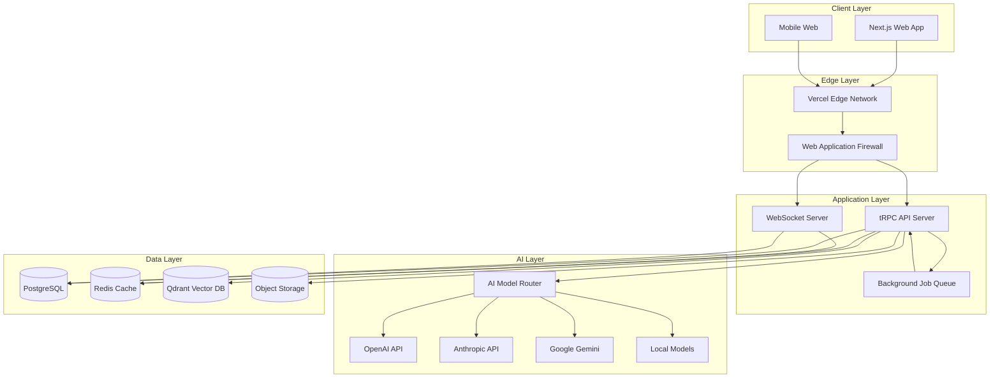

# FlowForge: AI-Powered Iterative Development Platform

**Comprehensive Project Plan & Technical Specification**

Version: 1.0
Date: 2025-01-12
Status: Planning Phase

---

## Executive Summary

FlowForge is a cloud-native, team-first platform that transforms software development through AI-guided iterative workflows. Built on the proven BMad Method methodology, it provides specialized AI agents, structured workflows, and collaborative features in an intuitive chat-based interface.

### Key Differentiators

- **Team-Native**: Built for collaboration from day 1
- **Multi-Model AI**: Works with OpenAI, Anthropic, Google, and open-source models
- **Hybrid Deployment**: Cloud SaaS or self-hosted
- **Usage-Based Pricing**: Fair, predictable costs
- **Methodology-First**: Structured planning before coding

---

## Table of Contents

- [1. Strategic Overview](#1-strategic-overview)
- [2. Product Vision](#2-product-vision)
- [3. Target Market](#3-target-market)
- [4. Core Features](#4-core-features)
- [5. Technical Architecture](#5-technical-architecture)
- [6. Development Roadmap](#6-development-roadmap)
- [7. Business Model](#7-business-model)
- [8. Go-to-Market Strategy](#8-go-to-market-strategy)
- [9. Success Metrics](#9-success-metrics)
- [10. Risk Analysis](#10-risk-analysis)

---

## 1. Strategic Overview

### 1.1 Problem Statement

Modern software development faces critical challenges:

**For Teams:**

- ❌ AI tools optimize individual productivity but fragment team workflow
- ❌ No shared context between team members using different AI tools
- ❌ Methodology and structure lost in rush to "just ship code"
- ❌ Junior developers need guidance, not just autocomplete
- ❌ Planning documents outdated before implementation starts

**For Companies:**

- ❌ AI tools locked to specific IDEs (Cursor, GitHub Copilot)
- ❌ Vendor lock-in to single AI provider
- ❌ No control over data/models in cloud-only solutions
- ❌ Unpredictable AI costs at scale
- ❌ No audit trail or governance

### 1.2 Solution: FlowForge

A platform that provides:

✅ **Unified Team Workspace**: All team members collaborate in shared projects
✅ **Guided Workflows**: Structured methodology ensures quality
✅ **Specialized AI Agents**: PM, Architect, Developer, QA roles
✅ **Multi-Model Support**: Choose best AI for each task, avoid lock-in
✅ **Hybrid Deployment**: Cloud convenience or on-premise control
✅ **Transparent Pricing**: Usage-based, pay for what you use

### 1.3 Market Opportunity

**Total Addressable Market (TAM):**

- 27M software developers globally (Evans Data Corp, 2024)
- Average team size: 5-7 developers
- ~4M software development teams worldwide

**Serviceable Addressable Market (SAM):**

- Teams of 2-50 developers (startup to mid-market)
- Tech-forward companies adopting AI
- Estimate: 1M teams ($50-$500/team/month = $600M-$6B/year)

**Serviceable Obtainable Market (SOM):**

- Year 1 target: 1,000 teams
- Year 3 target: 25,000 teams
- Year 5 target: 100,000 teams

### 1.4 Competitive Landscape

| Competitor                   | Strength                  | Weakness                          | FlowForge Advantage                      |
| ---------------------------- | ------------------------- | --------------------------------- | ---------------------------------------- |
| **Cursor/Windsurf**          | IDE integration, code gen | Single-player, no methodology     | Team-first, structured workflow          |
| **GitHub Copilot Workspace** | GitHub integration        | One-shot generation, no iteration | Iterative refinement, multi-phase        |
| **v0.dev/Bolt.new**          | Fast prototypes           | No planning, throwaway code       | Planning → architecture → implementation |
| **Jira/Linear**              | Issue tracking            | No AI, no execution help          | AI-powered planning AND execution        |
| **ChatGPT/Claude**           | General purpose           | No structure, no persistence      | Domain-specific agents, workflow state   |

**Positioning:** "The first AI platform designed for how teams actually build software - together, iteratively, with structure."

---

## 2. Product Vision

### 2.1 Core Concept

**"Your AI Development Team in a Browser"**

FlowForge provides a virtual team of specialized AI agents (Product Manager, Architect, Developer, QA) that guide your real team through proven development workflows, all in a collaborative workspace.

### 2.2 User Experience Flow

```
Login → Choose/Create Project → Select Track → Chat with Agents →
Generate Artifacts → Collaborate with Team → Review & Refine →
Move to Next Phase → Export/Integrate → Ship Product
```

### 2.3 Key Personas

#### Primary: "Taylor the Tech Lead"

- 5-7 years experience
- Leading team of 3-5 developers
- Frustrated with planning overhead vs. deadline pressure
- Wants: Structure without bureaucracy
- Pain: Keeping team aligned while moving fast

#### Secondary: "Sam the Startup CTO"

- Technical founder
- Team of 2-10 engineers
- Needs to scale processes as team grows
- Wants: Quality without slowing down
- Pain: Inconsistent practices across team

#### Tertiary: "Morgan the Engineering Manager"

- Managing 3-5 teams (15-30 people)
- Mid-market company (100-500 employees)
- Needs visibility and standardization
- Wants: Team autonomy with guardrails
- Pain: Every team does things differently

### 2.4 Success Criteria

**User Success:**

- Time to first artifact: < 15 minutes
- Workflow completion rate: > 80%
- User satisfaction (NPS): > 40
- Team adoption: > 70% of invited members active

**Business Success:**

- 40% MoM growth in active teams (Year 1)
- $500K ARR by end of Year 1
- $5M ARR by end of Year 2
- 70% gross margin
- < $200 CAC, > $1,200 LTV

---

## 3. Target Market

### 3.1 Ideal Customer Profile (ICP)

**Company Characteristics:**

- Company size: 10-500 employees
- Development team: 2-50 engineers
- Industry: SaaS, fintech, e-commerce, healthtech
- Tech stack: Modern (React, Node, Python, Go)
- Stage: Seed to Series B
- Annual budget for dev tools: $50K-$500K

**Buying Behavior:**

- Bottom-up adoption (developers choose tools)
- Free trial → team pilot → company-wide rollout
- Decision maker: Engineering Manager or CTO
- Procurement: Credit card (< $10K/year) or PO (> $10K)

**Psychographics:**

- Early adopters of AI tools
- Value quality over speed
- Frustrated with current planning tools
- Willing to learn new methodology
- Care about team collaboration

### 3.2 Market Segmentation

#### Segment 1: Startup Teams (2-10 devs)

- **Size**: ~500K teams globally
- **Need**: Fast iteration with minimal process
- **Track**: Quick Flow + BMad Method
- **ARPU**: $200-500/month
- **Go-to-Market**: Product Hunt, dev communities, content

#### Segment 2: Scale-up Teams (10-50 devs)

- **Size**: ~200K teams globally
- **Need**: Standardization without bureaucracy
- **Track**: BMad Method + Enterprise
- **ARPU**: $1,000-5,000/month
- **Go-to-Market**: Sales-assisted, case studies, ROI calculators

#### Segment 3: Enterprise Teams (50-500 devs)

- **Size**: ~50K teams globally
- **Need**: Governance, compliance, control
- **Track**: Enterprise + Custom
- **ARPU**: $10,000-50,000/month
- **Go-to-Market**: Enterprise sales, pilots, champions

### 3.3 Geographic Focus

**Phase 1 (Year 1):** English-speaking markets

- United States (primary)
- Canada, UK, Australia

**Phase 2 (Year 2):** European expansion

- Germany, France, Netherlands, Nordics
- Begin internationalization (i18n)

**Phase 3 (Year 3):** Global expansion

- APAC (India, Singapore, Japan)
- Latin America (Brazil, Mexico)
- Multi-language support

---

## 4. Core Features

### 4.1 MVP Features (Launch)

**Essential (Must-Have):**

1. **Project Management**
   - Create project
   - Select planning track (Quick Flow, BMad Method)
   - Project dashboard
   - Basic settings

2. **Chat Interface**
   - Real-time chat with AI agents
   - Markdown rendering
   - Code syntax highlighting
   - Message history

3. **Agent System**
   - 3 core agents (PM, Architect, Developer)
   - Agent switching
   - Contextual suggestions

4. **Workflow Execution**
   - Single workflow (PRD)
   - Step-by-step guidance
   - Progress tracking

5. **Artifact Management**
   - View generated documents
   - Inline editing
   - Version history (basic)
   - Export to Markdown

6. **Team Collaboration**
   - Invite team members
   - Shared project access
   - Activity feed (basic)

7. **Multi-Model AI**
   - OpenAI integration
   - Anthropic integration
   - Model selection per agent

8. **Authentication & Authorization**
   - Email/password signup
   - Google OAuth
   - Basic RBAC (Owner, Member)

### 4.2 V1 Features (3 months post-launch)

**Important (Should-Have):**

1. **Extended Agents**
   - All 12 BMad Method agents
   - Agent customization (name, persona)

2. **Full Workflows**
   - All 4 phases
   - All planning tracks
   - Workflow state machine

3. **Advanced Artifacts**
   - Document sharding
   - Relationship mapping
   - Search within documents

4. **Enhanced Collaboration**
   - Comments on artifacts
   - @mentions
   - Notifications
   - Real-time presence

5. **Integrations**
   - Git sync (GitHub, GitLab)
   - Export to Notion
   - Webhook API

6. **Model Expansion**
   - Google Gemini
   - Mistral
   - Llama (self-hosted option)

### 4.3 V2 Features (6 months post-launch)

**Advanced (Nice-to-Have):**

1. **Party Mode**
   - Multi-agent conversations
   - Consensus building
   - Debate mode

2. **Visual Tools**
   - Diagram editor (Mermaid)
   - Kanban board
   - Roadmap view

3. **Advanced RBAC**
   - Custom roles
   - Project-level permissions
   - Audit logs

4. **Analytics**
   - Team velocity
   - Artifact quality scores
   - AI usage analytics

5. **Self-Hosting**
   - Docker deployment
   - Kubernetes helm chart
   - On-premise licensing

6. **API & Extensions**
   - Public REST API
   - GraphQL API
   - Custom workflow builder

### 4.4 V3+ Features (12+ months)

**Future (Long-term):**

1. **Marketplace**
   - Custom agents
   - Community workflows
   - Templates

2. **Advanced AI**
   - Fine-tuned models
   - Company-specific training
   - Multi-modal (image, video)

3. **Enterprise**
   - SSO (SAML, OIDC)
   - Advanced security
   - Compliance certifications
   - Dedicated infrastructure

4. **Platform**
   - Plugin system
   - Third-party integrations
   - Developer SDK

---

## 5. Technical Architecture

### 5.1 Technology Stack

#### Frontend

```yaml
Framework: Next.js 14 (App Router)
  Why: React + SSR, optimal performance, great DX

UI Library: React 18 + TypeScript
  Why: Industry standard, type safety, huge ecosystem

UI Components: shadcn/ui
  Why: Radix + Tailwind, accessible, customizable

State Management: Zustand
  Why: Lightweight, perfect for chat state

Real-time: Socket.io client
  Why: Bidirectional, fallback support

Forms: React Hook Form + Zod
  Why: Performance + validation

Editor: Monaco Editor
  Why: VS Code experience, feature-rich

Markdown: react-markdown + remark/rehype
  Why: Extensible, syntax highlighting

Diagrams: Mermaid.js
  Why: Already in BMad docs, text-based

Build Tool: Turbo + pnpm
  Why: Monorepo support, fast installs
```

#### Backend

```yaml
Runtime: Node.js 20 LTS
  Why: JavaScript full-stack, huge ecosystem

Framework: Fastify
  Why: Faster than Express, TypeScript support

API: tRPC
  Why: End-to-end type safety, no codegen

Database: PostgreSQL 16
  Why: Reliable, JSON support, full-text search

ORM: Prisma
  Why: Type-safe, migrations, great DX

Vector DB: Qdrant
  Why: Self-hostable, fast, Rust-based

Cache: Redis
  Why: Fast, pub/sub for real-time

Queue: BullMQ
  Why: Reliable, Redis-based, scheduling

File Storage: S3-compatible
  Why: Standard, works with AWS/MinIO/R2

Search: Meilisearch
  Why: Fast, typo-tolerant, self-hostable

AI Framework: LangChain.js
  Why: Multi-model, tools, memory, streaming
```

#### Infrastructure

```yaml
Hosting (Cloud): Vercel (frontend) + Railway (backend)
  Why: Best-in-class DX, auto-scaling, edge

Hosting (Self-hosted): Docker + Docker Compose
  Why: Simple deployment, single-command

CI/CD: GitHub Actions
  Why: Free, integrated, flexible

Monitoring: Sentry + Axiom
  Why: Errors + logs, affordable

Analytics: PostHog
  Why: Open source, self-hostable, product analytics

Email: Resend
  Why: Developer-friendly, reliable
```

### 5.2 System Architecture



### 5.3 Data Flow

**User Message Flow:**

```
User types message
  ↓
WebSocket to server
  ↓
Validate & authenticate
  ↓
Load conversation context
  ↓
Retrieve relevant artifacts (RAG)
  ↓
Build agent prompt
  ↓
Stream to AI model
  ↓
Parse response (text + tool calls)
  ↓
Execute tools (create/update artifacts)
  ↓
Stream response to user
  ↓
Save to database
  ↓
Update workflow state
  ↓
Notify team members (if relevant)
```

**Artifact Generation Flow:**

```
Agent identifies need for artifact
  ↓
Calls create_artifact tool
  ↓
Generate content based on template + context
  ↓
Save to database (with version)
  ↓
Generate vector embeddings
  ↓
Store in vector DB
  ↓
Update project state
  ↓
Notify user in chat
  ↓
Display in artifacts panel
```

### 5.4 Deployment Architecture

#### Cloud Deployment (Vercel + Railway)

```yaml
Frontend:
  Platform: Vercel
  Regions: Global edge
  Features:
    - Edge caching
    - ISR (Incremental Static Regeneration)
    - Image optimization
    - Automatic HTTPS

Backend:
  Platform: Railway
  Regions: us-west-2 (primary), eu-west-1 (secondary)
  Services:
    - API Server (auto-scaling)
    - WebSocket Server (sticky sessions)
    - Worker Queue (horizontal scaling)
    - PostgreSQL (managed)
    - Redis (managed)

External Services:
  - Qdrant Cloud (vector DB)
  - Cloudflare R2 (object storage)
  - Resend (email)
  - PostHog (analytics)
```

#### Self-Hosted Deployment (Docker)

```yaml
Deployment Method: Docker Compose

Services:
  - app-frontend: Next.js app
  - app-backend: Node.js API
  - postgres: PostgreSQL 16
  - redis: Redis 7
  - qdrant: Qdrant vector DB
  - meilisearch: Search engine
  - minio: S3-compatible storage
  - traefik: Reverse proxy + SSL

Requirements:
  - 4 CPU cores
  - 16GB RAM
  - 100GB SSD
  - Docker 24+ & Docker Compose v2

Commands:
  - docker-compose up -d
  - docker-compose logs -f
  - docker-compose down
```

---

## 6. Development Roadmap

### 6.1 Phase 0: Foundation (Weeks 1-4)

**Goal:** Set up infrastructure and validate core concepts

**Team:** 2 engineers (full-stack)

**Deliverables:**

- [ ] Repository setup (monorepo with Turborepo)
- [ ] Development environment (Docker Compose)
- [ ] CI/CD pipeline (GitHub Actions)
- [ ] Database schema v1 (Prisma)
- [ ] Authentication system (Clerk)
- [ ] Basic UI shell (Next.js + shadcn)
- [ ] Hello-world API endpoint (tRPC)
- [ ] OpenAI integration proof-of-concept
- [ ] WebSocket chat proof-of-concept

**Risks:**

- Multi-model abstraction complexity → Mitigate with adapter pattern
- Real-time scalability → Test with load testing early

### 6.2 Phase 1: MVP (Weeks 5-16)

**Goal:** Launch with Quick Flow track end-to-end

**Team:** 3-4 engineers (2 full-stack, 1 frontend, 1 backend)

**Sprints:**

**Sprint 1-2: Core Chat (Weeks 5-8)**

- [ ] Chat UI with streaming responses
- [ ] Markdown rendering + syntax highlighting
- [ ] Message persistence
- [ ] Conversation history
- [ ] Agent switching UI

**Sprint 3-4: Workflows (Weeks 9-12)**

- [ ] Workflow state machine
- [ ] Progress tracking UI
- [ ] Tech-spec workflow implementation
- [ ] PRD workflow implementation
- [ ] Workflow validation

**Sprint 5-6: Artifacts & Collaboration (Weeks 13-16)**

- [ ] Document viewer/editor
- [ ] Version history
- [ ] Export to Markdown
- [ ] Team invitations
- [ ] Shared project access
- [ ] Activity feed

**Launch Criteria:**

- 3 working agents (PM, Architect, Dev)
- 2 complete workflows (tech-spec, PRD)
- Team collaboration (2-5 members)
- 2 AI models (OpenAI, Anthropic)
- Export functionality
- < 2 second response time (p95)
- < 0.1% error rate

### 6.3 Phase 2: Full Feature Set (Weeks 17-28)

**Goal:** Complete BMad Method track, all phases

**Team:** 5-6 engineers

**Deliverables:**

- [ ] All 12 agents implemented
- [ ] All 4 phases with workflows
- [ ] Document sharding
- [ ] Party Mode (multi-agent)
- [ ] Git integration (GitHub, GitLab)
- [ ] Advanced RBAC
- [ ] Search functionality
- [ ] Comments & annotations
- [ ] Mobile-responsive design
- [ ] Performance optimization (< 1s p95)

### 6.4 Phase 3: Enterprise & Scale (Weeks 29-52)

**Goal:** Production-ready for 1,000+ teams

**Team:** 8-10 engineers

**Deliverables:**

- [ ] Self-hosting option (Docker)
- [ ] SSO support (Google, GitHub, SAML)
- [ ] Advanced analytics
- [ ] API & webhooks
- [ ] Multi-language support (i18n)
- [ ] Compliance certifications (SOC 2 Type I)
- [ ] Dedicated infrastructure option
- [ ] 99.9% uptime SLA
- [ ] Auto-scaling (10,000+ concurrent users)

### 6.5 Ongoing: Platform Evolution

**Focus Areas:**

- Marketplace for custom workflows
- Plugin system
- Mobile native apps (React Native)
- Desktop apps (Tauri)
- Advanced AI (fine-tuning, multi-modal)
- Integrations ecosystem (Jira, Linear, Slack)

---

## 7. Business Model

### 7.1 Pricing Strategy

**Model:** Usage-Based + Seat-Based Hybrid

```yaml
FlowForge Pricing:

Free Tier (Starter):
  Cost: $0/month
  Includes:
    - 1 active project
    - 2 team members
    - 100 AI messages/month
    - Quick Flow track
    - 3 core agents
    - Community support
  Target: Individual developers, evaluation

Pro Tier:
  Cost: $20/seat/month + usage
  Includes:
    - Unlimited projects
    - Up to 10 team members
    - 1,000 AI messages/month (base)
    - All planning tracks
    - All 12+ agents
    - Party mode
    - Git sync
    - Email support
  Overage: $0.02/message after 1,000
  Target: Small teams (2-10 people)

Team Tier:
  Cost: $40/seat/month + usage
  Includes:
    - Everything in Pro
    - Unlimited team members
    - 2,500 AI messages/month (base)
    - Advanced RBAC
    - Priority support
    - SSO (Google, GitHub)
    - 99.5% uptime SLA
  Overage: $0.015/message after 2,500
  Target: Growing teams (10-50 people)

Enterprise Tier:
  Cost: Custom (starts at $100/seat/month)
  Includes:
    - Everything in Team
    - Self-hosting option
    - Custom AI models
    - SAML SSO
    - Dedicated support
    - Custom contracts
    - 99.9% uptime SLA
    - Compliance (SOC 2, HIPAA, etc.)
  Target: Large teams (50+ people)
```

**AI Message Pricing:**

- Messages are counted per user request (regardless of length)
- Agent responses don't count (we eat that cost)
- Document generation counts as 1 message
- Party mode counts as 1 message (not per agent)

**Rationale:**

- Predictable base cost (seat-based)
- Scales with usage (fair for light users)
- Incentivizes efficiency (users optimize prompts)
- Overage pricing is reasonable (not punitive)

### 7.2 Revenue Projections

**Year 1 (Launch to Month 12):**

```
Month 1-3: Beta (100 teams, $0 revenue - free tier testing)
Month 4: Launch (200 teams, $4K MRR)
Month 6: Growth (500 teams, $15K MRR)
Month 9: Scaling (1,000 teams, $40K MRR)
Month 12: Mature (2,000 teams, $80K MRR)

ARR End of Year 1: ~$500K
```

**Year 2 (Months 13-24):**

```
Focus: Scale to 10,000 teams
Enterprise customers: 10 @ $50K/year = $500K
Team customers: 2,000 @ $480/year = $960K
Pro customers: 8,000 @ $240/year = $1,920K

ARR End of Year 2: ~$3.4M
```

**Year 3 (Months 25-36):**

```
Focus: Scale to 25,000 teams
Enterprise customers: 50 @ $75K/year = $3.75M
Team customers: 5,000 @ $600/year = $3M
Pro customers: 20,000 @ $300/year = $6M

ARR End of Year 3: ~$12.75M
```

### 7.3 Unit Economics

**Customer Acquisition Cost (CAC):**

```
Blended CAC Target: $150/team
  - Self-serve (70%): $50 (content, ads)
  - Sales-assisted (25%): $300 (sales team)
  - Enterprise (5%): $1,000 (enterprise sales)
```

**Lifetime Value (LTV):**

```
Average Team (Pro):
  - Monthly revenue: $60 (3 seats @ $20)
  - Gross margin: 75% (AI costs ~25%)
  - Churn rate: 5%/month
  - Lifetime: 20 months
  - LTV: $60 × 0.75 × 20 = $900

LTV:CAC Ratio: 6:1 (healthy, > 3:1 target)
```

**Gross Margin:**

```
Revenue: $100
AI Costs: $20 (OpenAI, Anthropic APIs)
Infrastructure: $5 (hosting, database)
COGS: $25

Gross Margin: 75%
```

---

## 8. Go-to-Market Strategy

### 8.1 Launch Strategy

**Pre-Launch (3 months before):**

- [ ] Build waitlist landing page
- [ ] Content marketing (blog posts, guides)
- [ ] Engage in dev communities (Reddit, HN, Discord)
- [ ] Beta program (50 teams)
- [ ] Collect testimonials and case studies

**Launch Week:**

- [ ] Product Hunt launch (aim for #1)
- [ ] Hacker News Show HN post
- [ ] Reddit r/programming, r/webdev
- [ ] Twitter/X announcement thread
- [ ] Newsletter to waitlist (10K+ emails)
- [ ] Press release to tech media

**Post-Launch (First 3 months):**

- [ ] Weekly blog posts (SEO + education)
- [ ] YouTube tutorials
- [ ] Podcast tour (developer podcasts)
- [ ] Conference talks (submit to 10+ conferences)
- [ ] Open source adjacent tools (CLI, VS Code extension)

### 8.2 Marketing Channels

**Organic (Focus for Year 1):**

1. **Content Marketing**
   - Blog: 2 posts/week (SEO + thought leadership)
   - Topics: Software methodology, AI tools, team collaboration
   - Keywords: "agile development tool", "AI project planning", "team workflow"

2. **Developer Community**
   - Reddit: r/programming, r/webdev, r/SaaS
   - Hacker News: Show HN, Ask HN
   - Dev.to, Hashnode: Cross-post blog content
   - Discord communities: Join and provide value

3. **Social Media**
   - Twitter/X: Daily tips, progress updates
   - LinkedIn: Thought leadership, case studies
   - YouTube: Tutorial videos, demos

4. **SEO**
   - Target keywords: "software planning tool", "AI development workflow"
   - Backlinks: Guest posts, tool directories
   - Domain authority building

**Paid (Start Month 6):**

1. **Google Ads**
   - Budget: $5K/month
   - Target: "agile tool", "project management software"
   - Landing pages: Track-specific

2. **LinkedIn Ads**
   - Budget: $3K/month
   - Target: Engineering Managers, CTOs
   - Content: Case studies, ROI calculators

3. **Developer Newsletters**
   - Cooperpress newsletters (JavaScript Weekly, Node Weekly)
   - TLDR Dev, Console
   - Budget: $2K/month

**Partnerships:**

1. **Tool Integrations**
   - GitHub, GitLab (official integration)
   - Notion, Confluence (export)
   - Slack, Discord (notifications)

2. **Agency Partners**
   - Development agencies (25+ devs)
   - Offer white-label option
   - Revenue share: 20%

3. **Training Partners**
   - Coding bootcamps
   - Online courses (Udemy, Coursera)
   - Certification program

### 8.3 Sales Strategy

**Self-Serve (70% of revenue):**

- Free tier → upgrade within app
- In-app prompts for paid features
- Email nurture campaigns
- Chat support converts to sales

**Sales-Assisted (25% of revenue):**

- Inbound leads from website
- Demo requests → 30-min call
- 14-day pilot with 5-10 users
- Success metrics tracking
- Close within 30 days

**Enterprise (5% of revenue):**

- Outbound to target accounts
- Enterprise AEs (hire at $1M ARR)
- Multi-month pilots
- Custom pricing and contracts
- Success team dedicated support

---

## 9. Success Metrics

### 9.1 Product Metrics

**Activation:**

- Time to first message: < 5 min (goal)
- Time to first artifact: < 15 min (goal)
- Workflow completion rate: > 60% (MVP), > 80% (mature)

**Engagement:**

- DAU/MAU ratio: > 40% (sticky product)
- Messages per user per week: > 20
- Sessions per user per week: > 5
- Session duration: 15-30 min average

**Retention:**

- Day 1 retention: > 70%
- Week 1 retention: > 50%
- Month 1 retention: > 40%
- Month 3 retention: > 30%

**Collaboration:**

- % teams with 3+ active members: > 60%
- Messages per team per week: > 100
- Shared artifacts per project: > 5

### 9.2 Business Metrics

**Growth:**

- MoM user growth: 30-50% (Year 1)
- MoM revenue growth: 20-40% (Year 1)
- Viral coefficient: > 1.5 (invites per user)

**Revenue:**

- ARPU (Average Revenue Per User): $25/month
- Net Revenue Retention: > 110%
- Expansion revenue: 30% of total revenue

**Efficiency:**

- CAC: < $150
- LTV: > $900
- LTV:CAC: > 6:1
- Payback period: < 3 months

**Operational:**

- Gross margin: > 70%
- Burn multiple: < 2x (burn / ARR growth)
- Magic number: > 0.75 (ARR growth / sales&marketing spend)

### 9.3 Technical Metrics

**Performance:**

- API response time (p95): < 500ms
- Chat message latency (p95): < 2s
- Page load time (p95): < 3s
- Time to first byte: < 500ms

**Reliability:**

- Uptime: > 99.5% (SLA: 99.9% for Enterprise)
- Error rate: < 0.1%
- Mean time to recovery: < 30 min

**Scalability:**

- Concurrent users supported: 10,000+
- Messages per second: 1,000+
- Database query time (p95): < 100ms
- Cache hit rate: > 80%

---

## 10. Risk Analysis

### 10.1 Technical Risks

| Risk                             | Probability | Impact   | Mitigation                                            |
| -------------------------------- | ----------- | -------- | ----------------------------------------------------- |
| **AI API rate limits/downtime**  | High        | High     | Multi-model fallback, queue system, status page       |
| **Real-time scalability issues** | Medium      | High     | Load testing, auto-scaling, CDN                       |
| **Data loss or corruption**      | Low         | Critical | Automated backups, point-in-time recovery, audit logs |
| **Security breach**              | Low         | Critical | Penetration testing, bug bounty, SOC 2                |
| **Poor AI output quality**       | Medium      | Medium   | Prompt engineering, fine-tuning, human review option  |

### 10.2 Market Risks

| Risk                                             | Probability | Impact   | Mitigation                                    |
| ------------------------------------------------ | ----------- | -------- | --------------------------------------------- |
| **Incumbents (GitHub, Atlassian) copy features** | High        | High     | Move fast, build moat with methodology        |
| **AI models become commoditized**                | Medium      | Medium   | Focus on workflow and team value, not just AI |
| **Market not ready for AI workflows**            | Low         | Critical | Beta validation, pivot to simpler use cases   |
| **Regulatory changes (AI regulation)**           | Medium      | Medium   | Compliance program, legal counsel             |

### 10.3 Business Risks

| Risk                           | Probability | Impact   | Mitigation                                         |
| ------------------------------ | ----------- | -------- | -------------------------------------------------- |
| **Insufficient funding**       | Medium      | Critical | Raise seed round, bootstrap efficiently            |
| **Can't hire fast enough**     | Medium      | High     | Contractor network, remote-first, competitive comp |
| **Churn higher than expected** | Medium      | High     | User research, improve onboarding, success team    |
| **CAC higher than projected**  | Medium      | Medium   | Double-down on organic, optimize paid spend        |
| **Founder conflict**           | Low         | Critical | Clear roles, communication, mediation plan         |

### 10.4 Mitigation Strategies

**Technical:**

- Multi-cloud strategy (avoid single point of failure)
- Comprehensive monitoring and alerting
- Disaster recovery plan (RPO: 1 hour, RTO: 4 hours)
- Regular security audits and penetration testing
- Feature flags for safe rollouts

**Market:**

- Continuous customer development (weekly user interviews)
- Competitor monitoring and differentiation
- Build unique IP (methodology, data, network effects)
- Diversify customer base (no single customer > 10% revenue)

**Business:**

- 18 months runway minimum
- Monthly board updates with key metrics
- Quarterly OKR planning and review
- Emergency fund (3 months operating expenses)
- Insurance (D&O, cyber liability)

---

## 11. Team & Organization

### 11.1 Founding Team

**Required Roles:**

1. **CEO / Co-founder (Product)**
   - Vision and strategy
   - Product management
   - Fundraising
   - Customer development

2. **CTO / Co-founder (Technical)**
   - Technical architecture
   - Team building
   - Infrastructure
   - Security

3. **Head of Design (Early Hire)**
   - UI/UX design
   - Brand identity
   - User research

### 11.2 Hiring Plan

**Year 1 (0-12 months):**

```
Month 0: 2 founders
Month 3: +2 engineers (full-stack)
Month 6: +1 designer, +1 engineer
Month 9: +2 engineers (frontend + backend)
Month 12: +1 product manager, +1 sales

Total: 10 people
```

**Year 2 (13-24 months):**

```
Quarter 1: +2 engineers, +1 sales
Quarter 2: +2 engineers, +1 customer success
Quarter 3: +2 engineers, +1 marketing, +1 sales
Quarter 4: +2 engineers, +1 DevOps

Total: 21 people
```

**Year 3 (25-36 months):**

```
Scale to 50+ people across:
- Engineering (25)
- Product (5)
- Sales (8)
- Marketing (4)
- Customer Success (5)
- Operations (3)
```

### 11.3 Culture & Values

**Core Values:**

1. **User-Obsessed**
   - Build for users, not egos
   - Weekly user interviews
   - Ship fast, learn faster

2. **Technical Excellence**
   - Quality over quick hacks
   - Code review culture
   - Continuous learning

3. **Transparent & Direct**
   - Default to open
   - Candid feedback
   - No politics

4. **Iterative & Adaptive**
   - Embrace change
   - Learn from failures
   - Continuous improvement

5. **Team First**
   - Collaborate over compete
   - Help teammates succeed
   - Celebrate wins together

---

## 12. Next Steps

### 12.1 Immediate Actions (Next 30 Days)

**Week 1:**

- [ ] Finalize team composition (founders + initial hires)
- [ ] Set up legal entity (Delaware C-Corp or LLC)
- [ ] Open business bank account
- [ ] Set up accounting (Quickbooks + Pilot.com)

**Week 2:**

- [ ] Create detailed UI mockups (Figma)
- [ ] Set up development infrastructure
- [ ] Initialize codebase (monorepo)
- [ ] Configure CI/CD pipeline

**Week 3:**

- [ ] Implement authentication system
- [ ] Build basic chat UI
- [ ] Integrate first AI model (OpenAI)
- [ ] Database schema v1

**Week 4:**

- [ ] End-to-end test (signup → chat → artifact)
- [ ] Performance baseline
- [ ] Security audit (basic)
- [ ] Demo to potential customers

### 12.2 Funding Strategy

**Bootstrap Phase (Months 0-3):**

- Self-funded or friends & family
- Goal: Prove concept, get first users
- Budget: $50K-$100K

**Seed Round (Months 4-6):**

- Target: $1M-$2M
- Valuation: $8M-$12M
- Investors: Early-stage VCs, angels
- Use: Team expansion, product development

**Series A (Months 18-24):**

- Target: $8M-$12M
- Valuation: $40M-$60M
- Investors: Growth VCs
- Use: Scale sales & marketing, enterprise features

### 12.3 Key Milestones

**Q1 2025:**

- ✅ Project plan complete
- ✅ Technical architecture defined
- [ ] Team hired (2-4 engineers)
- [ ] MVP development started

**Q2 2025:**

- [ ] MVP complete
- [ ] Private beta (50 teams)
- [ ] Seed funding secured
- [ ] Public launch (Product Hunt)

**Q3 2025:**

- [ ] 500 active teams
- [ ] $15K MRR
- [ ] All 4 phases implemented
- [ ] First enterprise customer

**Q4 2025:**

- [ ] 2,000 active teams
- [ ] $80K MRR
- [ ] Self-hosting option
- [ ] Series A preparation

---

## 13. Conclusion

FlowForge represents a significant opportunity to transform how software teams collaborate and build products. By combining proven methodology (BMad Method), modern AI capabilities, and thoughtful team-first design, we can create a category-defining product.

**Key Success Factors:**

1. **Execution Speed**: First-mover advantage in AI-powered team workflows
2. **Product Quality**: Polish and reliability from day 1
3. **Customer Focus**: Build what teams actually need, not what's technically cool
4. **Team Culture**: Attract world-class talent with compelling mission
5. **Financial Discipline**: Efficient growth, sustainable unit economics

**The Opportunity:**

- Large TAM ($600M-$6B)
- Underserved market (current tools don't address team collaboration)
- Technology tailwinds (AI capabilities improving rapidly)
- Founder expertise (proven methodology from BMad Method)
- Timing is right (teams adopting AI tools now)

**The Ask:**

This is a venture-scale opportunity requiring:

- $2M seed funding
- World-class technical co-founder
- Design-minded founding team member
- 18-month runway to Series A
- Commitment to move fast and learn

**Let's build the future of software development.** 🚀

---

**Document Version:** 1.0
**Last Updated:** 2025-01-12
**Next Review:** 2025-02-12
**Owner:** Product Team

---

## Appendices

- [A. UI Design Mockups](./UI_DESIGN.md)
- [B. Backend Architecture](./BACKEND_ARCHITECTURE.md)
- [C. Database Schema](./DATABASE_SCHEMA.md)
- [D. Agent System Design](./AGENT_SYSTEM.md)
- [E. Deployment Guide](./DEPLOYMENT.md)
- [F. Market Research](./MARKET_RESEARCH.md)
- [G. Competitive Analysis](./COMPETITIVE_ANALYSIS.md)
- [H. Financial Model](./FINANCIAL_MODEL.md)
