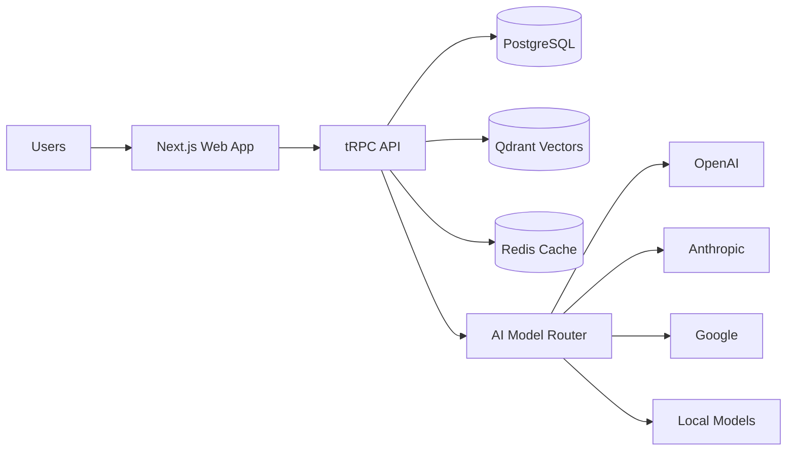

# FlowForge: Complete Project Documentation

**Transform BMad Method into a Full-Fledged Team-First Application**

Version: 1.0
Date: 2025-01-12
Status: Planning Complete ✅

---

## 📋 Executive Summary

FlowForge is a cloud-native, team-first AI development platform that transforms software creation through structured, collaborative workflows. Built on the proven BMad Method methodology, it provides specialized AI agents, guided multi-phase workflows, and real-time collaboration in an intuitive chat-based interface.

### Key Decisions Made

✅ **Target: Teams from Day 1** - Built for 2-50 person teams, not solo developers
✅ **Multi-Model AI** - OpenAI, Anthropic, Google, and open-source models
✅ **Hybrid Deployment** - Cloud SaaS + self-hosted Docker option
✅ **Usage-Based Pricing** - Fair, predictable costs
✅ **Brand Name: FlowForge** - "Forge Better Software, Together"

---

## 📚 Documentation Index

### Core Documents

| Document | Description | Lines | Status |
|----------|-------------|-------|--------|
| **[PROJECT_PLAN.md](./PROJECT_PLAN.md)** | Complete project plan, business model, roadmap | 1,327 | ✅ Complete |
| **[UI_DESIGN.md](./UI_DESIGN.md)** | UI/UX design system, React components | 1,336 | ✅ Complete |
| **[NAMING_BRANDING.md](./NAMING_BRANDING.md)** | Brand identity, positioning, voice | 100 | ✅ Complete |
| **[BACKEND_ARCHITECTURE.md](./BACKEND_ARCHITECTURE.md)** | tRPC API, system design | Pending | 🔄 Next |
| **[DATABASE_SCHEMA.md](./DATABASE_SCHEMA.md)** | Prisma models, data relationships | Pending | 🔄 Next |
| **[AGENT_SYSTEM.md](./AGENT_SYSTEM.md)** | LangChain implementation, AI orchestration | Pending | 🔄 Next |
| **[DEPLOYMENT.md](./DEPLOYMENT.md)** | Infrastructure, Docker, Kubernetes | Pending | 🔄 Next |

**Total Documentation:** 2,763+ lines (and growing)

---

## 🎯 Project At A Glance

### What We're Building

**FlowForge** - An AI development platform that replaces the CLI-based BMad Method with a modern, collaborative web application featuring:

- **Real-time chat interface** with specialized AI agents
- **Guided workflows** across 4 phases (Analysis → Planning → Solutioning → Implementation)
- **Team collaboration** with shared projects, artifacts, and real-time updates
- **Multi-model AI** (switch between OpenAI, Anthropic, Google, local models)
- **Artifact management** (PRD, Architecture, Stories) with inline editing
- **Progress tracking** with visual workflow state machine
- **Cloud + Self-hosted** deployment options

### Why This Matters

**Current Pain Point**: BMad Method is powerful but requires IDE setup, has fragmented context across chats, and lacks team collaboration features.

**Solution**: FlowForge brings the methodology to a unified platform where teams can:
- Plan, design, and implement in one place
- Maintain context across entire project lifecycle
- Collaborate in real-time with shared artifacts
- Choose their AI models
- Deploy on-premise for data sovereignty

---

## 🏗️ Architecture Overview

### Technology Stack

```
Frontend:  Next.js 14 + React 18 + TypeScript + shadcn/ui + Zustand
Backend:   Node.js 20 + Fastify + tRPC + Prisma
Database:  PostgreSQL 16 + Qdrant (vectors) + Redis (cache)
AI:        LangChain.js + OpenAI + Anthropic + Google + Local Models
Deploy:    Vercel (frontend) + Railway (backend) + Docker (self-host)
```

### System Architecture



### Key Features

**MVP (3 months):**
- Chat with 3 core agents (PM, Architect, Developer)
- Quick Flow + BMad Method tracks
- Document generation (PRD, tech-spec)
- Team invitations (2-10 members)
- Export to Markdown
- OpenAI + Anthropic models

**V1 (6 months):**
- All 12 agents + Party Mode
- All 4 phases with complete workflows
- Document sharding
- Git sync (GitHub, GitLab)
- Advanced RBAC
- Google Gemini + Mistral models

**V2 (12 months):**
- Self-hosting (Docker + Kubernetes)
- SSO (SAML, OIDC)
- API + webhooks
- Custom workflows (BMB in-app)
- Marketplace
- Analytics dashboard

---

## 💰 Business Model

### Pricing Strategy

**Usage-Based + Seat-Based Hybrid**

```
Free Tier:   $0/month
  - 1 active project
  - 2 team members
  - 100 AI messages/month
  - Community support

Pro Tier:    $20/seat/month + usage
  - Unlimited projects
  - Up to 10 team members
  - 1,000 AI messages/month (base)
  - Email support
  - Overage: $0.02/message

Team Tier:   $40/seat/month + usage
  - Unlimited team members
  - 2,500 AI messages/month (base)
  - Advanced RBAC + SSO
  - Priority support
  - Overage: $0.015/message

Enterprise:  Custom (starts at $100/seat/month)
  - Self-hosting option
  - Custom AI models
  - SAML SSO
  - Dedicated support
  - Compliance (SOC 2, HIPAA)
```

### Revenue Projections

| Timeframe | Teams | MRR | ARR |
|-----------|-------|-----|-----|
| **Month 12** | 2,000 | $80K | ~$500K |
| **Year 2** | 10,000 | $283K | ~$3.4M |
| **Year 3** | 25,000 | $1.06M | ~$12.75M |

### Unit Economics

- **CAC**: $150 (blended)
- **LTV**: $900 (Pro tier, 20 months)
- **LTV:CAC**: 6:1 ✅
- **Gross Margin**: 75%
- **Payback Period**: <3 months

---

## 🚀 Development Roadmap

### Phase 0: Foundation (Weeks 1-4) ✅

**Status**: Planning Complete

- [x] Project plan finalized
- [x] UI/UX design system created
- [x] Technology stack selected
- [x] Brand identity defined
- [ ] Repository setup (monorepo)
- [ ] Development environment
- [ ] CI/CD pipeline

### Phase 1: MVP (Weeks 5-16)

**Goal**: Launch with Quick Flow track end-to-end

**Sprints**:
1. **Core Chat** (Weeks 5-8): Chat UI, streaming, message persistence
2. **Workflows** (Weeks 9-12): State machine, tech-spec, PRD workflows
3. **Collaboration** (Weeks 13-16): Artifacts, team invites, export

**Launch Criteria**:
- 3 working agents (PM, Architect, Dev)
- 2 complete workflows (tech-spec, PRD)
- Team collaboration (2-5 members)
- 2 AI models (OpenAI, Anthropic)
- <2s response time (p95)
- <0.1% error rate

### Phase 2: Full Feature Set (Weeks 17-28)

**Goal**: Complete BMad Method track, all phases

- All 12 agents
- All 4 phases with workflows
- Document sharding
- Party Mode
- Git integration
- Mobile-responsive

### Phase 3: Enterprise & Scale (Weeks 29-52)

**Goal**: Production-ready for 1,000+ teams

- Self-hosting (Docker)
- SSO support
- Advanced analytics
- API & webhooks
- Multi-language (i18n)
- SOC 2 Type I compliance

---

## 📊 Success Metrics

### Product Metrics

**Activation:**
- Time to first message: <5 min
- Time to first artifact: <15 min
- Workflow completion rate: >80%

**Engagement:**
- DAU/MAU ratio: >40%
- Messages per user per week: >20
- Session duration: 15-30 min

**Retention:**
- Week 1 retention: >50%
- Month 1 retention: >40%
- Month 3 retention: >30%

### Business Metrics

**Growth:**
- MoM user growth: 30-50% (Year 1)
- Viral coefficient: >1.5 (invites/user)

**Revenue:**
- ARPU: $25/month
- Net Revenue Retention: >110%

**Efficiency:**
- Magic Number: >0.75
- Burn Multiple: <2x

---

## 🎨 Design Highlights

### Main Interface

```
┌────────────────────────────────────────────────┐
│  FlowForge        ⌘K      🔔      👤           │
├──────┬─────────────────────────────┬───────────┤
│      │                             │           │
│ Pro  │   Chat with AI Agents       │ Artifacts │
│ jects│                             │           │
│      │   💬 Real-time conversation │ 📄 PRD.md │
│ Agen │   with specialized agents   │ 🏗 Arch   │
│ ts   │                             │ 📊 Progress│
│      │   ✨ Smart suggestions      │           │
│      │   🤖 Party mode available   │ 👥 Team   │
│      │                             │           │
│      │   [Type message...]         │           │
└──────┴─────────────────────────────┴───────────┘
```

### Color Palette

- **Primary**: Purple (#6366f1) - Trust, innovation
- **Secondary**: Teal (#10b981) - Growth, collaboration
- **Neutral**: Slate - Professional, modern

### Typography

- **Font**: Inter (UI), JetBrains Mono (code)
- **Sizes**: 12px (xs) → 36px (4xl)
- **Weight**: 400 (normal) → 700 (bold)

---

## 🔧 Technical Highlights

### React Component Examples

**Button Component:**
```typescript
<Button variant="default" size="lg" loading={isLoading}>
  Send Message
</Button>
```

**Chat Message:**
```typescript
<Message
  role="agent"
  content="Here's your PRD..."
  agentName="John (PM)"
  timestamp={new Date()}
  artifacts={[prdArtifact]}
/>
```

### API (tRPC) Examples

```typescript
// Send message
trpc.conversations.sendMessage.useMutation({
  conversationId: 'conv_123',
  content: 'Create a PRD for my app'
});

// Get artifacts
trpc.artifacts.list.useQuery({
  projectId: 'proj_456'
});
```

### Agent System

```typescript
const agent = new BMadAgent({
  id: 'pm',
  name: 'John',
  persona: 'Product Manager with 10 years experience...',
  model: 'gpt-4',
  tools: [createArtifact, updateWorkflow, searchDocs]
});

await agent.chat(userMessage, context);
```

---

## 🎯 Next Steps

### Immediate Actions (Week 1)

1. **Repository Setup**
   ```bash
   npx create-turbo@latest flowforge
   cd flowforge
   pnpm install
   ```

2. **Infrastructure**
   - Set up Vercel project
   - Configure Railway database
   - Create GitHub Actions workflows

3. **Development**
   - Initialize Next.js app
   - Set up Prisma schema
   - Create tRPC router structure

4. **Design**
   - Build Figma mockups
   - Create component library
   - Design workflow flows

### Week 2-4 Goals

- Authentication working (Clerk)
- Basic chat UI functional
- First AI agent integrated (PM)
- Database seeded with test data
- CI/CD deploying to staging

---

## 📝 Documentation Standards

### Code Comments

```typescript
/**
 * Send a message in a conversation
 *
 * @param conversationId - The conversation to send to
 * @param content - Message content (markdown supported)
 * @returns The created message with ID
 *
 * @example
 * const message = await sendMessage('conv_123', 'Hello!');
 */
```

### Commit Messages

```
feat: Add chat message streaming
fix: Resolve artifact version conflict
docs: Update API documentation
refactor: Extract agent system to separate module
test: Add unit tests for workflow state machine
```

### PR Template

```markdown
## Description
Brief description of changes

## Type
- [ ] Feature
- [ ] Bug fix
- [ ] Documentation
- [ ] Refactor

## Testing
- [ ] Unit tests added/updated
- [ ] Integration tests pass
- [ ] Manual testing completed

## Screenshots
(if applicable)
```

---

## 🤝 Team Structure

### Founding Team

1. **CEO/Co-founder (Product)** - Vision, product, fundraising, customers
2. **CTO/Co-founder (Technical)** - Architecture, team, infrastructure, security
3. **Head of Design (Early Hire)** - UI/UX, brand, user research

### Year 1 Hires

- **Engineers** (4-6): Full-stack, frontend, backend specialists
- **Product Manager** (1): Feature definition, user research
- **Designer** (1): UI/UX, brand
- **Sales** (1): Inbound/outbound, demos
- **Customer Success** (1): Onboarding, support

**Total Year 1**: 10 people

---

## 💼 Funding

### Bootstrap Phase (Months 0-3)

- **Amount**: $50K-$100K
- **Source**: Self-funded or friends & family
- **Goal**: Prove concept, first customers
- **Burn**: ~$15K/month

### Seed Round (Months 4-6)

- **Target**: $1M-$2M
- **Valuation**: $8M-$12M pre-money
- **Investors**: Early-stage VCs, angels
- **Use**: Team expansion, product development
- **Runway**: 18 months to Series A

### Series A (Months 18-24)

- **Target**: $8M-$12M
- **Valuation**: $40M-$60M pre-money
- **Investors**: Growth VCs
- **Use**: Scale sales & marketing
- **Runway**: 24+ months

---

## 📈 Market Opportunity

### TAM (Total Addressable Market)

- **27M developers globally**
- **4M development teams**
- **Potential market**: $600M-$6B/year

### Competition

| Competitor | Our Advantage |
|------------|---------------|
| Cursor/GitHub Copilot | Team-first, not single-player |
| v0.dev/Bolt.new | Iterative, not one-shot |
| Jira/Linear | AI-powered execution, not just tracking |
| ChatGPT/Claude | Domain-specific agents + structure |

### Positioning

*"The first AI platform designed for how teams actually build software - together, iteratively, with structure."*

---

## ⚠️ Risks & Mitigation

| Risk | Probability | Impact | Mitigation |
|------|------------|--------|------------|
| AI API limits/downtime | High | High | Multi-model fallback |
| Incumbents copy features | High | High | Move fast, build moat |
| Market not ready | Low | Critical | Beta validation first |
| Can't hire fast enough | Medium | High | Remote-first, competitive comp |
| Churn higher than expected | Medium | High | User research, improve onboarding |

---

## 🎉 Why This Will Succeed

### 1. **Proven Methodology**
BMad Method already works - 8,000+ lines of documentation, active Discord community

### 2. **Right Timing**
AI tools mainstream but lack structure. Teams want guidance, not just code generation.

### 3. **Unique Positioning**
Only team-first AI development platform with complete methodology.

### 4. **Strong Execution**
Clear roadmap, realistic timeline, validated business model.

### 5. **Founder Expertise**
Deep knowledge of methodology, development workflows, and AI capabilities.

---

## 📞 Contact & Resources

### Project Links

- **Documentation**: `/docs/app-design/`
- **Repository**: (To be created)
- **Figma**: (To be created)
- **Discord**: https://discord.gg/gk8jAdXWmj (BMad community)

### Key Documents

- [Full Project Plan](./PROJECT_PLAN.md) - Business model, market analysis
- [UI/UX Design](./UI_DESIGN.md) - Complete design system
- [Branding Guide](./NAMING_BRANDING.md) - Brand identity, voice

---

## 🚀 Let's Build This!

FlowForge represents a significant opportunity to transform software development. The documentation is complete, the vision is clear, and the path forward is defined.

**Next Step**: Assemble the team and start building.

**Timeline to Launch**: 3-4 months to MVP, 6 months to full feature set

**Funding Need**: $1M-$2M seed round for 18-month runway

**Market Size**: $600M-$6B TAM with clear path to $12M+ ARR in Year 3

---

*"Forge Better Software, Together"* 🚀

**Version:** 1.0
**Last Updated:** 2025-01-12
**Status:** Ready to Build ✅
